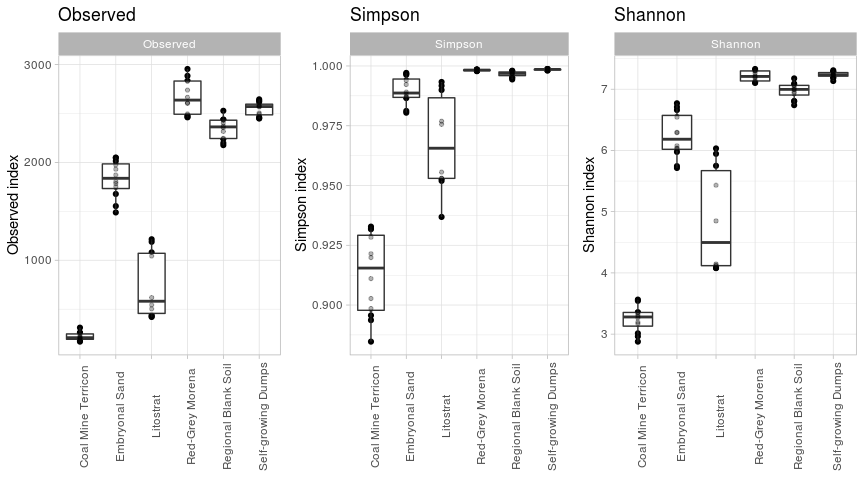
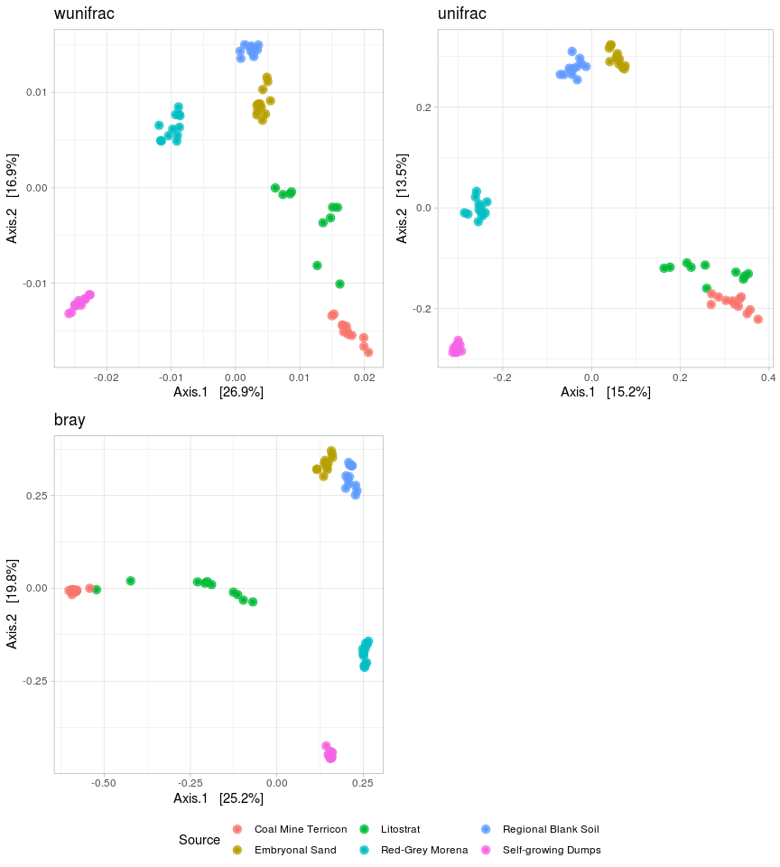
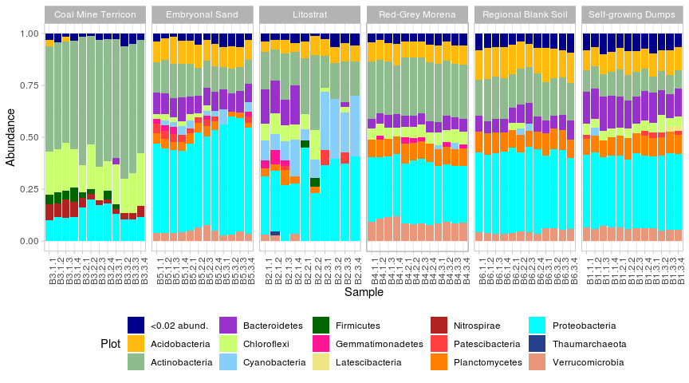

## Normalisation

Remove B2.2.3 and B2.2.4

---

## Alpha-diversity

<!-- -->

Альфа-разнообразие самозарастающего отвала, региональной почвы и морены в целом одинаково высокое, имеет сравнительно низкую дисперсию по образцам. Вероятно, горизонты, сформированные тут, достаточно гомогенны. Стоит отметить, что это горизонт AY, т.е. дифференциация по горизонтам уже есть. Для того же горизонта AY на песке количество ОТЕ существенно меньше, хотя таксоны все еще представлены достаточно равномерно (индекс Симпсона). На двух зарастающих почвах индексы разнообразия показывают бедное микробное сообщество: индексы разнообразия литострата обладают большой дисперсией (что, возможно, говорит о большом количестве микрониш в рамках одной почвы) и низкими значениями, а индексы бактериальных сообществ почвы террикона оказались ниже всех.

---

## Beta-diversity

<!-- -->

Также заметно, что бактериальные сообщества литострата обладают большой гетерогенностью, и вместе с сообществами террикона существенно отличаются от других почв.

---

## Taxonomy
<!-- -->

Очень большое количество Actinobacteria, Chloroflexi и Nitrospirae в терриконе, и сравнительно мало обычных Proteobacteria и Verrucomicrobia. Песок в целом похож на обычную почву, а вот литострат, как и ранее, очень разнобразен таксономически. Интересно большое количество Cyanobacteria. 
