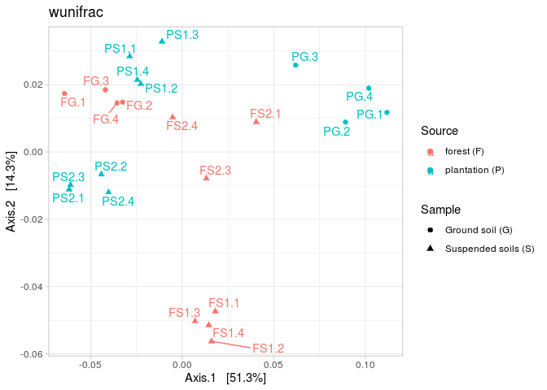

## Библиотеки и импорт данных

```r
library(dada2)
library(Biostrings)
library(DECIPHER)
library(phyloseq)
library(ggplot2)
library(ape)
library(ggpubr)
library(plyr)
library(ggrepel)

setwd('/home/alexey/Analysis/Vietnam_abakumov/')
ps <- readRDS("ps.RData")

ps <- subset_taxa(ps, Order != "Chloroplast")
ps <- subset_taxa(ps, Family != "Mitochondria")

ps <- rarefy_even_depth(ps)
```


## Коррекция данных


У нас есть образцы-вылеты, а именно V2.2 V9.2. Уберем их.
Также выкинем одну из подвешенных почв - например, V9

---


Итого, у нас есть контрольная почва и две подвешенных почвы - (S)uspended/(G)round soils, для двух разныз участков - (F)orest/(P)lantation

Переназовем их приличными названиями - первая буква обозначает тип участка, вторая - источник почвы.

## Барграфы и бета-разнообразие


<!-- --><!-- --><!-- --><!-- -->

Барграфы и бета-разнообразие. Видно, что на плантациях подвешенные почвы отличаются от подвешенных почв в лесу: в лесу все однородно, на плантациях более похоже. На всякий случай метрики:

unifrac - учитывает филогенетический компонент, не учитывает численность отдельных ОТЕ;
wunifrac - учитывает и филогению, и численность ОТЕ;
bray - использует только занчения численности ОТЕ 

## Альфа-разнообразие

<!-- -->

Разнообразие в подвешенных почвах разное: Симпсон почти одинаковый, т.е. выровненность сообщества почти одинаковая. Лесная почва - FG - очень разнообразна по числу видов, это ожидаемо.


---

## DeSEQ


```
##     rawReads deseqReads activePart
## FG     24472      12805  0.5232511
## FS1    24472      13592  0.5554103
## FS2    18354       6836  0.3724529
```

```
##     rawReads deseqReads activePart
## PG     24472      18132  0.7409284
## PS1    24472      19718  0.8057372
## PS2    24472      18787  0.7676937
```
Очень много ОТЕ, достоверно меняющихся - примерно половина от общего числа ридов. Как отобрать самые интересные?

Два варанта

1. Выберем мажорные компоненты сообщества, сделаем DeSEQ-анализ. Это показывает достоверную разницу основных компонентов - они многочисленны, их вклад заметен

2. Выбираем ОТЕ с самой большой дисперсией (т.е. разница в которых в сравнении максимальна) - это те, кто максимально отличает наши сообщества. Их также много - возьмем первые 70, например


Для примера часть таблицы достоверно различающихся значений (первые 10 строк)

```
##        FG FS1 FS2          Phylum               Class              Order
## ASV17   0 550   1 Verrucomicrobia    Verrucomicrobiae Chthoniobacterales
## ASV32   0 465   0 Verrucomicrobia    Verrucomicrobiae Chthoniobacterales
## ASV37   0 445   0  Actinobacteria      Actinobacteria  Pseudonocardiales
## ASV35   4   1 401     Chloroflexi     Ktedonobacteria  Ktedonobacterales
## ASV45   0 369   0  Actinobacteria      Actinobacteria  Pseudonocardiales
## ASV60   0 316   7  Thaumarchaeota     Nitrososphaeria  Nitrososphaerales
## ASV19  35 339  23  Proteobacteria Alphaproteobacteria   Sphingomonadales
## ASV7   39 115 341 Verrucomicrobia    Verrucomicrobiae Chthoniobacterales
## ASV49   1 264   1 Verrucomicrobia    Verrucomicrobiae Chthoniobacterales
## ASV73 246   0   0      Firmicutes             Bacilli    Lactobacillales
```


### Троичные диаграммы.

Диграммы для таблиц достоверных различий. 

Чем ближе точка к одному из углов, тем более это ОТЕ уникально для данной группы.

Важно: это не все сообщество, а только ОТЕ, достоверно меняющиеся по данным DeSEQ


ОТЕ с наибольшей дисперсией для лесной почвы (F)...
<!-- -->

...и мажорные ОТЕ для лесной почвы (F)

<!-- -->


ОТЕ с наибольшей дисперсией для плантаций (P)...
<!-- -->

...и мажорные ОТЕ для плантаций (P)

<!-- -->

