# Soils and substrates


```r
format_data_for_intersection <- function(ps, names, treshold=0){
  physeq <- prune_taxa(taxa_sums(ps) > 0, ps)
  groups <- levels(sample_data(physeq)[[names]] %>% as.factor())
  data <- merge_samples(physeq, names) %>% 
    psmelt() %>% 
    group_by(Sample, OTU) %>% 
    summarise(ASVs_abund = list(paste(OTU, 1:sum(Abundance))), Abund = sum(Abundance), .groups='keep') %>% 
    filter(Abund > 0) %>% 
    mutate(Valid = ifelse(Abund > treshold, T, F)) %>% 
    mutate(Name = ifelse(grepl("_", Sample, fixed=TRUE), paste0(Sample, ".", as.character(Valid)), Sample)) %>% 
    group_by(Name) %>% 
    summarise(ASVs = list(OTU), ASVs_abund = list(unlist(ASVs_abund)))
    
    return(data)
}

vienn_from_intersects <- function(data){
  require(ggVennDiagram)
  
  ASVs.list <- data$ASVs %>% as.list()
  names(ASVs.list) <- data$Name
  
  ASVs.abund.list <- data$ASVs_abund %>% as.list()
  names(ASVs.abund.list) <- data$Name
  
  list(ggVennDiagram(ASVs.list) + ggtitle("ASVs") + scale_fill_distiller(palette = "OrRd", trans = "reverse"),
       ggVennDiagram(ASVs.abund.list) + ggtitle("Reads") + scale_fill_distiller(palette = "OrRd", trans = "reverse"))
}
```


```r
intersects_from_groups <- function(data, groups){
    find_intersections <- function(c0.true, c0.false, c1, c2){
    require(dplyr)
    c0.true_unique <- setdiff(c0.true, c(c1, c2))
    c0.false_unique <- setdiff(c0.false, c(c1, c2))
    c0 <- c(c0.true, c0.false)
    c0_unique <- setdiff(c0, c(c1, c2))
    intersect <- intersect(c0, intersect(c1, c2))
    c0_c1 <- setdiff(intersect(c0, c1), c2)
    c0_c2 <- setdiff(intersect(c0, c2), c1)
    list(c0.true_unique = c0.true_unique %>% length(),
         c0.false_unique = c0.false_unique %>% length(),
         c0_unique = c0_unique %>% length(),
         c0_c1 = c0_c1 %>% length(),
         c0_c2 = c0_c2 %>% length(),
         intersect = intersect %>% length())
  }
  
  datamatrix <- data %>% 
    data.frame(row.names = data$Name) %>% 
    select(-Name) %>% 
    as.matrix() %>% 
    t()

  list(
    qual = find_intersections(datamatrix["ASVs", groups[1]][[1]], 
                              datamatrix["ASVs", groups[2]][[1]], 
                              datamatrix["ASVs", groups[3]][[1]], 
                              datamatrix["ASVs", groups[4]][[1]]),
    quan = find_intersections(datamatrix["ASVs_abund", groups[1]][[1]],
                              datamatrix["ASVs_abund", groups[2]][[1]],
                              datamatrix["ASVs_abund", groups[3]][[1]],
                              datamatrix["ASVs_abund", groups[4]][[1]])
    )
}

# intersects_from_groups(d, c("PS_Cannb..TRUE", "PS_Cannb..FALSE", ".PS", ".Cannb"))
```


## Soils


```r
p <- vienn_from_intersects(
  format_data_for_intersection(ps %>% subset_samples(
    Substrate %in% c("DF", "PS", "BG")), "Substrate"
    )
  )

ggarrange(p[[1]], p[[2]])
```

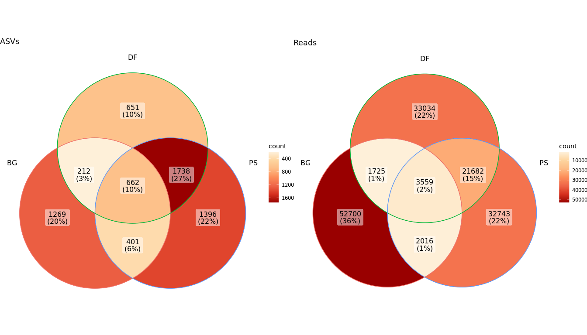<!-- -->

## Substrates


```r
p <- vienn_from_intersects(
  format_data_for_intersection(
    ps %>% subset_samples((Substrate %in% c("Cannb", "Wheat", "Oat")) & (Type == "substrate")), "Substrate"
    )
  )

ggarrange(p[[1]], p[[2]])
```

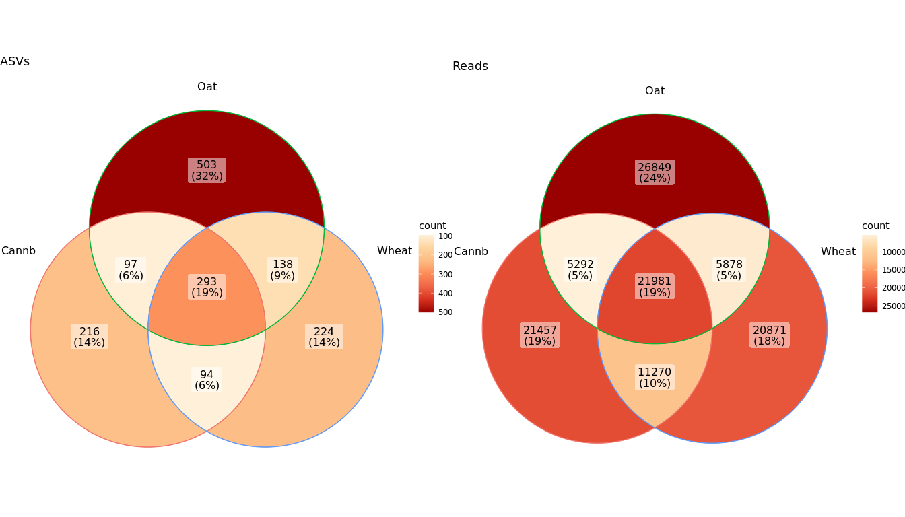<!-- -->

# Breeds

## Soils, Substrates and breeds

What share breeds takes from substrate and from soil? Especially if we filter minors?

### Filter - `sum(Abundance) > 10`:


```r
counter <- function(ps, primer, treshold) {
  soil <- strsplit(primer, split='_')[[1]][1]
  substrate <- strsplit(primer, split='_')[[1]][2]
  ps %>%
    format_data_for_intersection("Compare", treshold=treshold) %>%
    intersects_from_groups(c(paste0(primer, "..TRUE"),
                             paste0(primer, "..FALSE"),
                             paste0(".", soil),
                             paste0(".", substrate)))
}

PS_Oat <- ps %>% 
  subset_samples((Substrate %in% c("PS", "Oat", "")) & 
                          (Primer %in% c("PS_Oat", "")) & 
                          (Type != "use")) %>% 
  counter("PS_Oat", 10)

DF_Oat <- ps %>% 
  subset_samples((Substrate %in% c("DF", "Oat", "")) & 
                          (Primer %in% c("DF_Oat", "")) & 
                          (Type != "use")) %>% 
  counter("DF_Oat", 10)

BG_Oat <- ps %>% 
  subset_samples((Substrate %in% c("BG", "Oat", "")) & 
                          (Primer %in% c("BG_Oat", "")) & 
                          (Type != "use")) %>% 
  counter("BG_Oat", 10)

PS_Cannb <- ps %>% 
  subset_samples((Substrate %in% c("PS", "Cannb", "")) & 
                          (Primer %in% c("PS_Cannb", "")) & 
                          (Type != "use")) %>% 
  counter("PS_Cannb", 10)

DF_Cannb <- ps %>% 
  subset_samples((Substrate %in% c("DF", "Cannb", "")) & 
                          (Primer %in% c("DF_Cannb", "")) & 
                          (Type != "use")) %>% 
  counter("DF_Cannb", 10)

BG_Cannb <- ps %>% 
  subset_samples((Substrate %in% c("BG", "Cannb", "")) & 
                          (Primer %in% c("BG_Cannb", "")) & 
                          (Type != "use")) %>% 
  counter("BG_Cannb", 10)


intersect.qual <- data.frame(PS_Oat = unlist(PS_Oat$qual), PS_Cannb = unlist(PS_Cannb$qual),
                             DF_Oat = unlist(DF_Oat$qual), DF_Cannb = unlist(DF_Cannb$qual),
                             BG_Oat = unlist(BG_Oat$qual), BG_Cannb = unlist(BG_Cannb$qual)) %>% t() %>% data.frame()
colnames(intersect.qual) <- c("Unique Major", "Unique Minor", "Unique", "From soil", "From substrate", "Common")
intersect.qual$Name <- rownames(intersect.qual)
intersect.qual.long <- intersect.qual %>% select(-Unique) %>% tidyr::pivot_longer(!Name, names_to = "Group", values_to = "count")
intersect.qual.long$Group <- factor(intersect.qual.long$Group, levels = c("Unique Major", "Unique Minor", "From soil", "From substrate", "Common") %>% rev())

intersect.quan <- data.frame(PS_Oat = unlist(PS_Oat$quan), PS_Cannb = unlist(PS_Cannb$quan),
                             DF_Oat = unlist(DF_Oat$quan), DF_Cannb = unlist(DF_Cannb$quan),
                             BG_Oat = unlist(BG_Oat$quan), BG_Cannb = unlist(BG_Cannb$quan)) %>% t() %>% data.frame()
colnames(intersect.quan) <- c("Unique Major", "Unique Minor", "Unique", "From soil", "From substrate", "Common")
intersect.quan$Name <- rownames(intersect.quan)
intersect.quan.long <- intersect.quan %>% select(-Unique) %>% tidyr::pivot_longer(!Name, names_to = "Group", values_to = "count")
intersect.quan.long$Group <- factor(intersect.quan.long$Group, levels = c("Unique Major", "Unique Minor", "From soil", "From substrate", "Common") %>% rev())


p1 <- ggplot(intersect.qual.long, aes(Name, count, fill=Group)) + 
  geom_bar(aes(), stat="identity", position="stack") + 
  theme_light() + ggtitle('ASVs')
p2 <- ggplot(intersect.quan.long, aes(Name, count, fill=Group)) + 
  geom_bar(aes(), stat="identity", position="stack") + 
  theme_light() + ggtitle('Reads')
ggarrange(p1, p2, nrow=2, common.legend = T, legend = 'right')
```

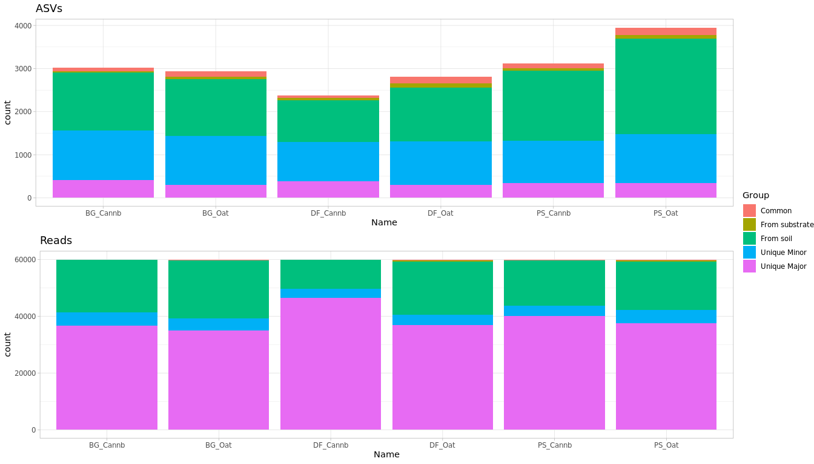<!-- -->


### Filter - `sum(Abundance) > 0.1% (600)`


```r
counter <- function(ps, primer, treshold) {
  soil <- strsplit(primer, split='_')[[1]][1]
  substrate <- strsplit(primer, split='_')[[1]][2]
  ps %>%
    format_data_for_intersection("Compare", treshold=treshold) %>%
    intersects_from_groups(c(paste0(primer, "..TRUE"),
                             paste0(primer, "..FALSE"),
                             paste0(".", soil),
                             paste0(".", substrate)))
}

PS_Oat <- ps %>% 
  subset_samples((Substrate %in% c("PS", "Oat", "")) & 
                          (Primer %in% c("PS_Oat", "")) & 
                          (Type != "use")) %>% 
  counter("PS_Oat", 600)

DF_Oat <- ps %>% 
  subset_samples((Substrate %in% c("DF", "Oat", "")) & 
                          (Primer %in% c("DF_Oat", "")) & 
                          (Type != "use")) %>% 
  counter("DF_Oat", 600)

BG_Oat <- ps %>% 
  subset_samples((Substrate %in% c("BG", "Oat", "")) & 
                          (Primer %in% c("BG_Oat", "")) & 
                          (Type != "use")) %>% 
  counter("BG_Oat", 600)

PS_Cannb <- ps %>% 
  subset_samples((Substrate %in% c("PS", "Cannb", "")) & 
                          (Primer %in% c("PS_Cannb", "")) & 
                          (Type != "use")) %>% 
  counter("PS_Cannb", 600)

DF_Cannb <- ps %>% 
  subset_samples((Substrate %in% c("DF", "Cannb", "")) & 
                          (Primer %in% c("DF_Cannb", "")) & 
                          (Type != "use")) %>% 
  counter("DF_Cannb", 600)

BG_Cannb <- ps %>% 
  subset_samples((Substrate %in% c("BG", "Cannb", "")) & 
                          (Primer %in% c("BG_Cannb", "")) & 
                          (Type != "use")) %>% 
  counter("BG_Cannb", 600)


intersect.qual <- data.frame(PS_Oat = unlist(PS_Oat$qual), PS_Cannb = unlist(PS_Cannb$qual),
                             DF_Oat = unlist(DF_Oat$qual), DF_Cannb = unlist(DF_Cannb$qual),
                             BG_Oat = unlist(BG_Oat$qual), BG_Cannb = unlist(BG_Cannb$qual)) %>% t() %>% data.frame()
colnames(intersect.qual) <- c("Unique Major", "Unique Minor", "Unique", "From soil", "From substrate", "Common")
intersect.qual$Name <- rownames(intersect.qual)
intersect.qual.long <- intersect.qual %>% select(-Unique) %>% tidyr::pivot_longer(!Name, names_to = "Group", values_to = "count")
intersect.qual.long$Group <- factor(intersect.qual.long$Group, levels = c("Unique Major", "Unique Minor", "From soil", "From substrate", "Common") %>% rev())

intersect.quan <- data.frame(PS_Oat = unlist(PS_Oat$quan), PS_Cannb = unlist(PS_Cannb$quan),
                             DF_Oat = unlist(DF_Oat$quan), DF_Cannb = unlist(DF_Cannb$quan),
                             BG_Oat = unlist(BG_Oat$quan), BG_Cannb = unlist(BG_Cannb$quan)) %>% t() %>% data.frame()
colnames(intersect.quan) <- c("Unique Major", "Unique Minor", "Unique", "From soil", "From substrate", "Common")
intersect.quan$Name <- rownames(intersect.quan)
intersect.quan.long <- intersect.quan %>% select(-Unique) %>% tidyr::pivot_longer(!Name, names_to = "Group", values_to = "count")
intersect.quan.long$Group <- factor(intersect.quan.long$Group, levels = c("Unique Major", "Unique Minor", "From soil", "From substrate", "Common") %>% rev())


p1 <- ggplot(intersect.qual.long, aes(Name, count, fill=Group)) + 
  geom_bar(aes(), stat="identity", position="stack") + 
  theme_light() + ggtitle('ASVs')
p2 <- ggplot(intersect.quan.long, aes(Name, count, fill=Group)) + 
  geom_bar(aes(), stat="identity", position="stack") + 
  theme_light() + ggtitle('Reads')
ggarrange(p1, p2, nrow=2, common.legend = T, legend = 'right')
```

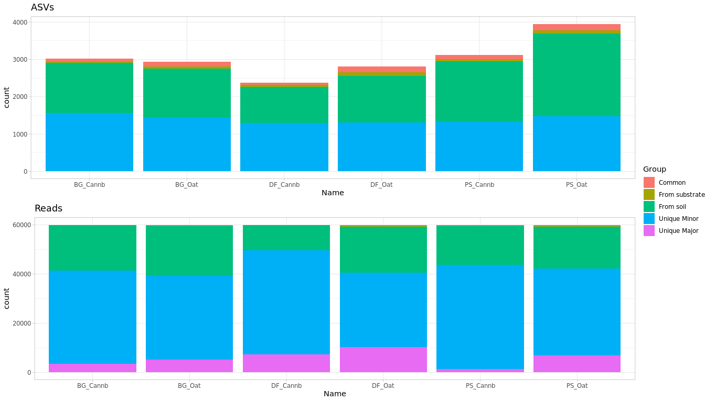<!-- -->


As a result: most parts of the taxa are unique for the breeds, or common with soils. This differences are not in minor taxa, but in both major and minor.

## Interserction of breeds

### Oat breeds


```r
p <- vienn_from_intersects(
  format_data_for_intersection(ps %>% subset_samples(
    (Primer %in% c("DF_Oat", "PS_Oat", "BG_Oat")) & (Type == "breed")), "Primer"
    )
  )

ggarrange(p[[1]], p[[2]])
```

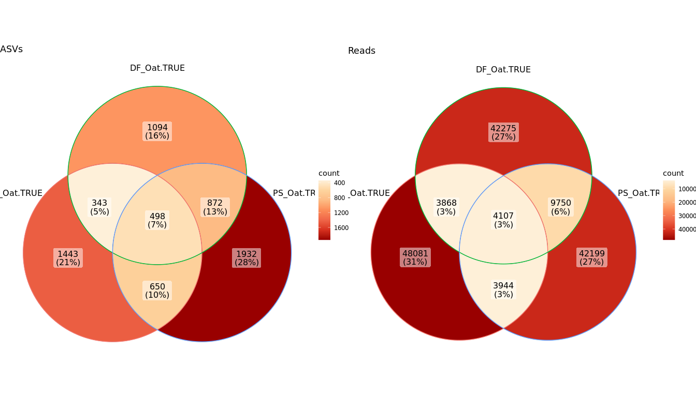<!-- -->

### Cannb breeds


```r
p <- vienn_from_intersects(
  format_data_for_intersection(ps %>% subset_samples(
    (Primer %in% c("DF_Cannb", "PS_Cannb", "BG_Cannb")) & (Type == "breed")), "Primer"
    )
  )

ggarrange(p[[1]], p[[2]])
```

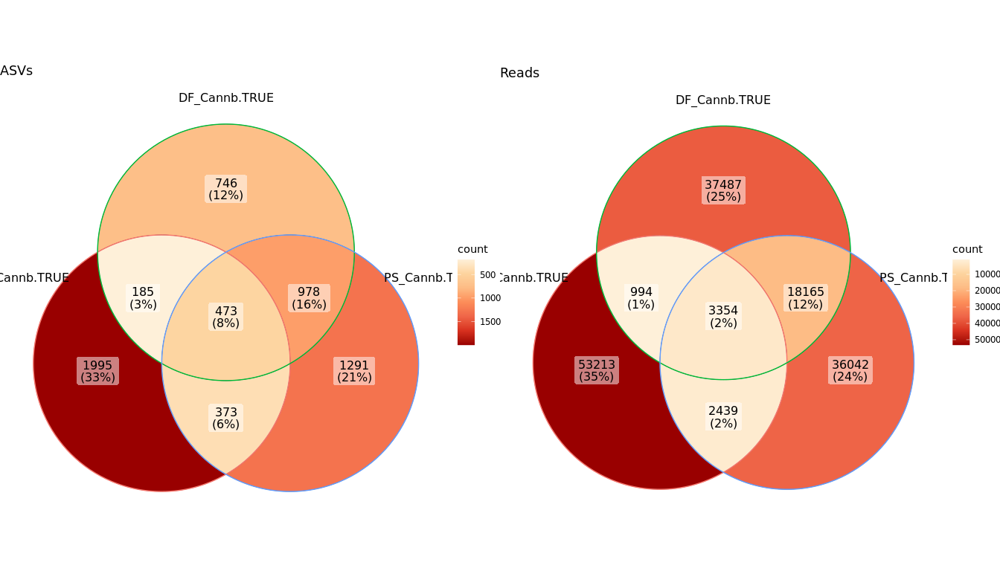<!-- -->

Breeds themselves are different (alongside a bit more similarity between PS and DF-based, not significand in Abundances)


## Soils, substrates and breeds on beta-diversity


```r
beta_plot <- function(ps, method, distance, ...){
  require(phyloseq)
  require(ggplot2)
  
  ps.prop <- transform_sample_counts(ps, function(x) x/sum(x))
  ords <- ordinate(ps.prop, method=method, distance=distance)
  plot_ordination(ps.prop, ords, title=deparse(substitute(ps)), ...) +
    geom_point(size=3, alpha=0.7) + 
    theme_light()
}


beta_plot(ps %>% subset_samples(Type != "use"), "PCoA", "bray", color="Compare", shape = "Type")
```

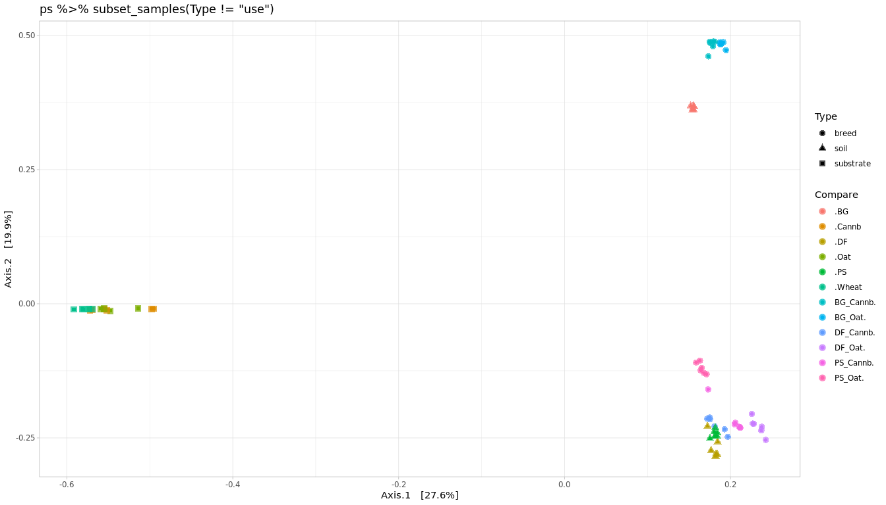<!-- -->

BAGS and their breeds clearly forms own cluster, and soils are from the other one. In terms of taxa, what is the difference?

## Taxa differences between BG - DF&PS clusters


```r
sig_table <- function(ps, formula, threshold){
  require(DESeq2)
  require(dplyr)
  
  ds <- phyloseq_to_deseq2(ps, formula)
  ds = estimateSizeFactors(ds, type="poscounts")
  ds = estimateDispersions(ds, fitType = "local")
  ds = DESeq(ds)
  #mcols(ds, use.names=TRUE)
  res = results(ds, cooksCutoff = FALSE)
  alpha = 0.05
  sigtab = res[which(res$padj < alpha), ]
  sigtab <- sigtab %>% data.frame() %>% dplyr::filter(baseMean >= threshold[1],
                                                      log2FoldChange >= threshold[2] | log2FoldChange <= threshold[2])
  if (nrow(sigtab) == 0) {
    return(NA)
  }
  sigtab = cbind(as(sigtab, "data.frame"),
                 as(tax_table(ps)[rownames(sigtab), ], "matrix")
  )
  return(sigtab)
}

draw_sig_table <- function(sig_table, rank){
  require(ggplot2)
  
  sig_table$Class <-  ifelse(is.na(sig_table$Class), 
                             paste(sig_table$Phylum, "// NA"), 
                             paste(sig_table$Class))
  sig_table$Order <-  ifelse(is.na(sig_table$Order), 
                             paste(sig_table$Class, "// NA"), 
                             paste(sig_table$Order))
  sig_table$Family <- ifelse(is.na(sig_table$Family), 
                             paste(sig_table$Order, "// NA"), 
                             paste(sig_table$Family))
  sig_table$Genus <- ifelse(is.na(sig_table$Genus), 
                            paste(sig_table$Class, "// NA"), 
                            paste(sig_table$Genus))
  
  sig_table[sig_table == "Burkholderia-Caballeronia-Paraburkholderia"] <- "Burkholderia"
  sig_table[sig_table == "Allorhizobium-Neorhizobium-Pararhizobium-Rhizobium"] <- "Pararhizobium"
  
  ggplot(sig_table, aes(y = sig_table[,rank], x=log2FoldChange, size = log(baseMean))) + 
    geom_point(aes(color=sig_table[,rank])) + guides(colour=FALSE) +
    theme_light() + facet_grid(rows = vars(Phylum), space = 'free_y', scales = 'free') +
    theme(strip.text.y = element_text(angle=0)) +
    theme(legend.position = "top") + ylab(rank)
}
```

### BG - DF


```r
ps.pair.bg.df <- ps %>% subset_samples(
  ((Substrate %in% c("BG", "DF")) | ((Primer %in% c("BG_Cannb", "DF_Cannb", "BG_Oat", "DF_Oat")) & (Type == "breed")))
                                         )

ps.pair.bg.df@sam_data$Compare <- gsub("_Oat.", "", ps.pair.bg.df@sam_data$Compare)
ps.pair.bg.df@sam_data$Compare <- gsub("_Cannb.", "", ps.pair.bg.df@sam_data$Compare)
ps.pair.bg.df@sam_data$Compare <- gsub("\\.", "", ps.pair.bg.df@sam_data$Compare)
ps.pair.bg.df@sam_data$Compare <- as.factor(ps.pair.bg.df@sam_data$Compare)

sig.tabe.pair.bg.df <- sig_table(ps.pair.bg.df, ~Compare, c(30, 2.5))

draw_sig_table(sig.tabe.pair.bg.df, "Genus")
```

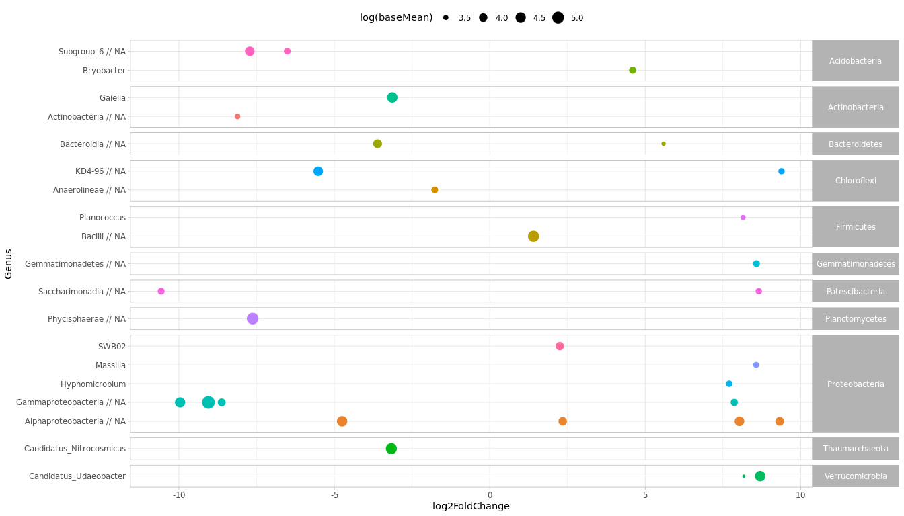<!-- -->

### BG - PS


```r
ps.pair.bg.ps <- ps %>% subset_samples(
  ((Substrate %in% c("BG", "PS")) | ((Primer %in% c("BG_Cannb", "PS_Cannb", "BG_Oat", "PS_Oat")) & (Type == "breed")))
                                         )

ps.pair.bg.ps@sam_data$Compare <- gsub("_Cannb.", "", ps.pair.bg.ps@sam_data$Compare)
ps.pair.bg.ps@sam_data$Compare <- gsub("_Oat.", "", ps.pair.bg.ps@sam_data$Compare)
ps.pair.bg.ps@sam_data$Compare <- gsub("\\.", "", ps.pair.bg.ps@sam_data$Compare)
ps.pair.bg.ps@sam_data$Compare <- as.factor(ps.pair.bg.ps@sam_data$Compare)

sig.tabe.pair.bg.ps <- sig_table(ps.pair.bg.ps, ~Compare, c(30, 2.5))

draw_sig_table(sig.tabe.pair.bg.ps, "Genus")
```

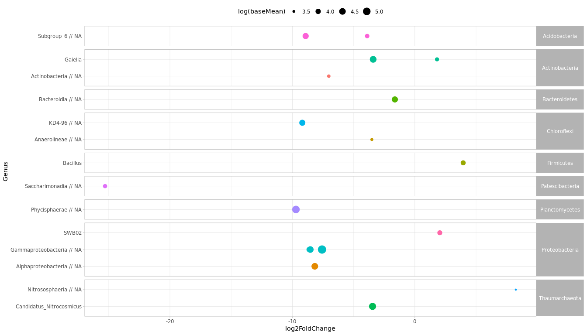<!-- -->

```r
tax.names <- c(rownames(sig.tabe.pair.bg.df), rownames(sig.tabe.pair.bg.ps)) %>% unique()
```

### Combined data


```r
plot_heatmap <- function(sig.ps, group = "SampleID", log.transform = TRUE){
  require(dplyr)
  require(phyloseq)
  require(ggplot2)
  
  sig.taxa.long <- psmelt(sig.ps) %>%
    arrange(Phylum) %>% 
    mutate(row = row_number()) %>% 
    mutate_at(c('Genus', 'Family', 'Order', 'Class', 'Phylum'), as.character)  # fuckin magic for ifelse tier
  
  sig.taxa.long$Abundance <- as.numeric(sig.taxa.long$Abundance)
  sig.taxa.long$Taxa <- ifelse(is.na(sig.taxa.long$Genus),
                               ifelse(is.na(sig.taxa.long$Family), 
                                      ifelse(is.na(sig.taxa.long$Order), 
                                             ifelse(is.na(sig.taxa.long$Class), 
                                                    paste(sig.taxa.long$Phylum, "// NA"), 
                                                    paste(sig.taxa.long$Class, "// NA")),
                                             paste(sig.taxa.long$Order, "// NA")),
                                      paste(sig.taxa.long$Family, "// NA")), 
                               sig.taxa.long$Genus)
  sig.taxa.long[sig.taxa.long == "Burkholderia-Caballeronia-Paraburkholderia"] <- "Burkholderia"
  sig.taxa.long[sig.taxa.long == "Allorhizobium-Neorhizobium-Pararhizobium-Rhizobium"] <- "Pararhizobium"
  
  
  ggplot(sig.taxa.long, aes(x = sig.taxa.long[,group], y = reorder(Taxa, row))) + 
    {if(log.transform)geom_tile(aes(fill=log(Abundance)))} +
    {if(!log.transform)geom_tile(aes(fill=Abundance))} +
    scale_fill_distiller(palette = "OrRd", trans = "reverse") +
    facet_grid(rows = vars(Phylum), scales = "free_y", space = "free") +
    theme(strip.text.y = element_text(angle = 0),
          panel.spacing = unit(0.05,'lines')) +
    xlab("") + ylab("") +
    theme(axis.text.x = element_text(angle = 90))
}

3852
```

```
## [1] 3852
```

```r
ps.plot <- prune_taxa(tax.names, ps %>% subset_samples(Type %in% c("breed", "soil")))
ps.plot@sam_data$Compare <- gsub("\\.", "", ps.plot@sam_data$Compare)
ps.plot@sam_data$Facet <- substr(ps.plot@sam_data$Compare, 1, 2)

plot_heatmap(ps.plot, "Compare") + facet_grid(~Facet, scales = "free")
```

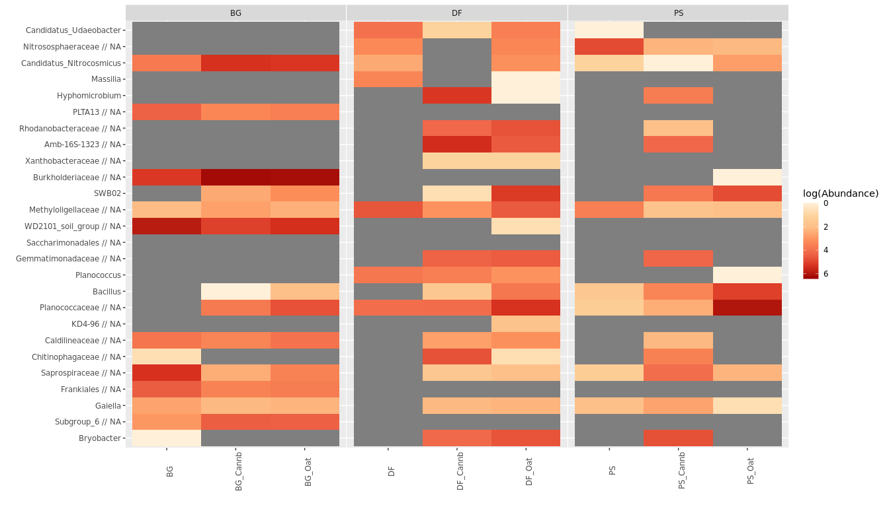<!-- -->

# Usage

## Beta-diversity


```r
beta_plot(ps %>% subset_samples(Type %in% c("breed", "use")), "PCoA", "bray", color="Primer", shape = "Substrate")
```

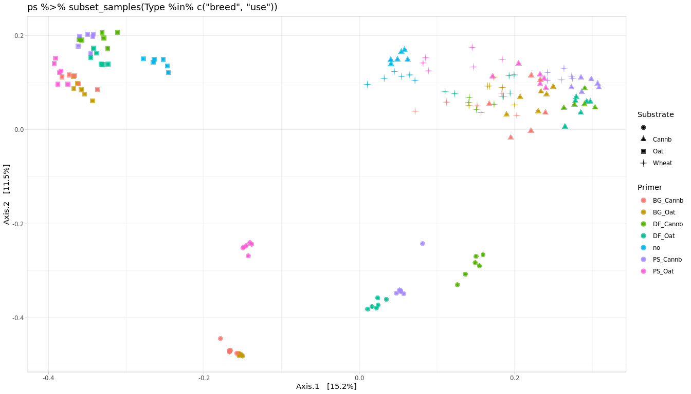<!-- -->


```r
beta_plot(ps.use, "PCoA", "bray", color="Primer", shape = "Substrate")
```

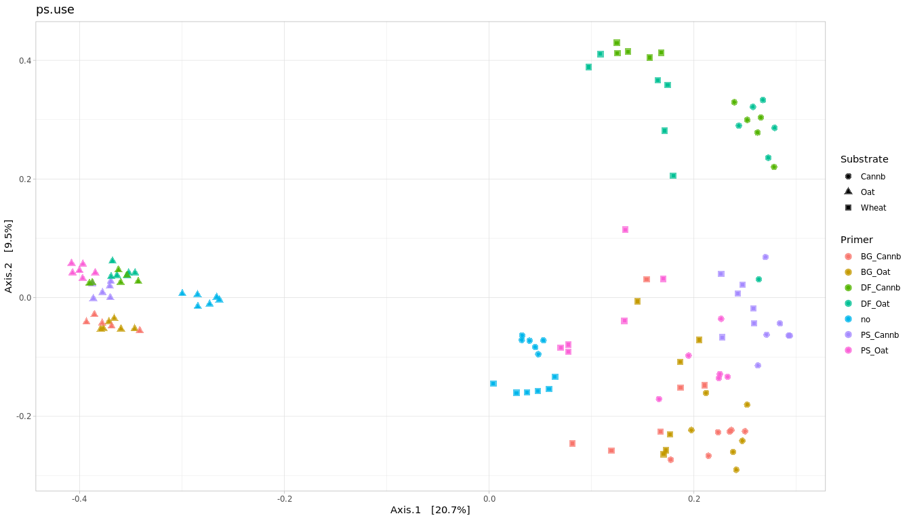<!-- -->

```r
dist <- phyloseq::distance(ps.use, method = "bray")
sample_df <- data.frame(sample_data(ps.use))
 
permanova <- adonis2(dist ~ Primer + Substrate, data = sample_df)
permanova
```

```
## Permutation test for adonis under reduced model
## Terms added sequentially (first to last)
## Permutation: free
## Number of permutations: 999
## 
## adonis2(formula = dist ~ Primer + Substrate, data = sample_df)
##            Df SumOfSqs      R2       F Pr(>F)    
## Primer      6   10.586 0.25669  9.5518  0.001 ***
## Substrate   2    9.597 0.23271 25.9778  0.001 ***
## Residual  114   21.058 0.51060                   
## Total     122   41.241 1.00000                   
## ---
## Signif. codes:  0 '***' 0.001 '**' 0.01 '*' 0.05 '.' 0.1 ' ' 1
```

## Nutritions and their correlations


```r
corrdata <- ps.use@sam_data %>% 
  data.frame() %>% 
  select(-Type, -Replica, -Nitrates) %>% 
  mutate(across(c(-Primer, -Substrate), as.double))

# corrdata

aov(Decomposition ~ Primer + Substrate, corrdata) %>% summary()
```

```
##              Df Sum Sq Mean Sq F value Pr(>F)    
## Primer        6   3966     661   28.81 <2e-16 ***
## Substrate     2  14327    7164  312.20 <2e-16 ***
## Residuals   114   2616      23                   
## ---
## Signif. codes:  0 '***' 0.001 '**' 0.01 '*' 0.05 '.' 0.1 ' ' 1
```

```r
cor <- Hmisc::rcorr(as.matrix(corrdata %>% select(-Primer, -Substrate)))
cor$r
```

```
##               Decomposition   Humidity AshContent         рН          C
## Decomposition     1.0000000 -0.8505358 -0.6536900 -0.5307589 -0.7548903
## Humidity         -0.8505358  1.0000000  0.3874172  0.3475204  0.6457630
## AshContent       -0.6536900  0.3874172  1.0000000  0.2856267  0.3518868
## рН               -0.5307589  0.3475204  0.2856267  1.0000000  0.8273140
## C                -0.7548903  0.6457630  0.3518868  0.8273140  1.0000000
```


```r
veganifyOTU <- function(physeq){
  require(phyloseq)
  if(taxa_are_rows(physeq)){physeq <- t(physeq)}
  return(as(otu_table(physeq), "matrix"))
}

ps.top1k <- prune_taxa(names(sort(taxa_sums(ps.use), TRUE)[1:1000]), ps.use)
X <- veganifyOTU(ps.top1k)
  
vare.cca <- vegan::cca(X ~ Decomposition + Humidity + AshContent + рН + C, data=corrdata)
anova(vare.cca)
```

```
## Permutation test for cca under reduced model
## Permutation: free
## Number of permutations: 999
## 
## Model: cca(formula = X ~ Decomposition + Humidity + AshContent + рН + C, data = corrdata)
##           Df ChiSquare      F Pr(>F)    
## Model      5    1.5074 6.2146  0.001 ***
## Residual 117    5.6760                  
## ---
## Signif. codes:  0 '***' 0.001 '**' 0.01 '*' 0.05 '.' 0.1 ' ' 1
```

```r
anova(vare.cca, by="terms")
```

```
## Permutation test for cca under reduced model
## Terms added sequentially (first to last)
## Permutation: free
## Number of permutations: 999
## 
## Model: cca(formula = X ~ Decomposition + Humidity + AshContent + рН + C, data = corrdata)
##                Df ChiSquare       F Pr(>F)    
## Decomposition   1    0.4335  8.9352  0.001 ***
## Humidity        1    0.2052  4.2292  0.001 ***
## AshContent      1    0.2104  4.3371  0.001 ***
## рН              1    0.4962 10.2276  0.001 ***
## C               1    0.1622  3.3441  0.001 ***
## Residual      117    5.6760                   
## ---
## Signif. codes:  0 '***' 0.001 '**' 0.01 '*' 0.05 '.' 0.1 ' ' 1
```

## CCA


```r
species.data <- vare.cca$CCA$v %>% 
               data.frame() %>% 
               mutate(ASV = rownames(.)) %>% 
               inner_join(data.frame(ASV = names(taxa_sums(ps.top1k)),
                                     Total.abund = taxa_sums(ps.top1k),
                                     ps.top1k@tax_table[,2], # Phylum
                                     ps.top1k@tax_table[,3], # Class
                                     ps.top1k@tax_table[,4],
                                     ps.top1k@tax_table[,5],
                                     ps.top1k@tax_table[,6]),
                          by = "ASV") %>% 
              tidyr::replace_na(list(Class="NA", Order="NA", Family="NA"))

samples.data <- vare.cca$CCA$u %>% 
  data.frame() %>% 
  mutate(Names = rownames(.)) %>% 
  inner_join(ps.top1k@sam_data %>% 
               data.frame() %>% 
               mutate(Samples = rownames(.)), by = c("Names" = "Samples"))
```


```r
major.phyla <- species.data %>% 
  group_by(Phylum) %>% 
  summarize(sum = sum(Total.abund)) %>% 
  arrange(desc(sum)) %>% 
  select(Phylum) %>% 
  head(10) %>% 
  as.vector()

ggplot() +
  geom_point(data=samples.data, 
             aes(x=CCA1, y=CCA2, color=Primer, shape=Substrate), size=3, alpha=0.7) +
  geom_segment(data = vare.cca$CCA$biplot %>% data.frame(),
               aes(x = 0, xend = CCA1, y = 0, yend = CCA2),
               alpha=0.8, color = "black",arrow = arrow(angle = 3)) +
  geom_text(data = vare.cca$CCA$biplot %>%
                    data.frame() %>%
                    mutate(Label = rownames(.)),
            aes(x=CCA1, y=CCA2, label= Label,
                hjust = -0.5), size=4) +
  theme_light() +
  ggtitle("B. Samples")
```

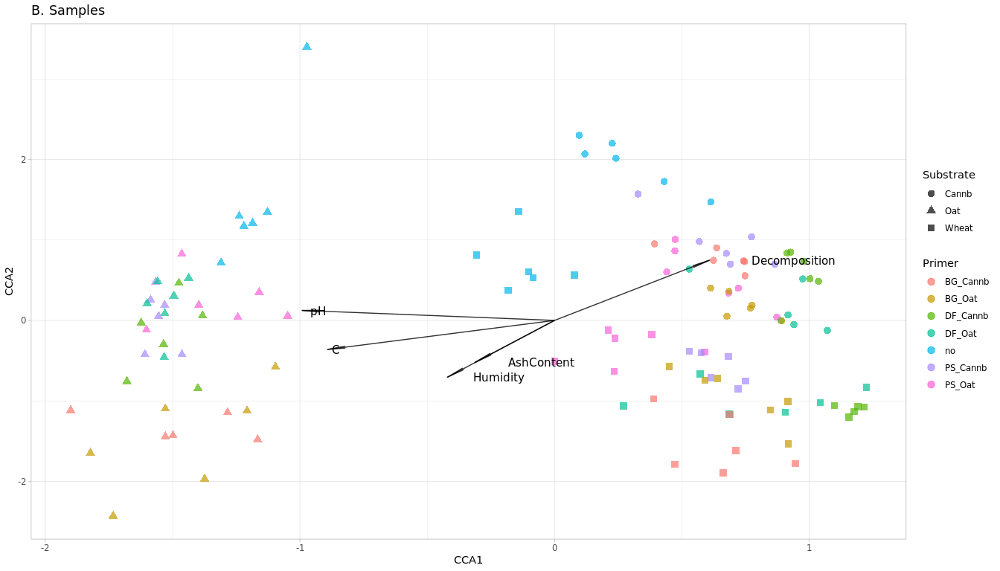<!-- -->

```r
for (i in major.phyla$Phylum) {
  
  if (i == "Proteobacteria") {
    for (j in c("Deltaproteobacteria", "Alphaproteobacteria", "Gammaproteobacteria")){
      
      p <- ggplot() +
      geom_point(data=species.data,
                 aes(x=CCA1, y=CCA2, size=Total.abund), alpha=0.2, color="grey80") +
      geom_point(data=species.data %>% filter(Class == j),
                 aes(x=CCA1, y=CCA2, color=Family, size=Total.abund), alpha=0.9) +
      geom_segment(data = vare.cca$CCA$biplot %>% data.frame(),
                   aes(x = 0, xend = CCA1, y = 0, yend = CCA2),
                   alpha=0.8, color = "black",arrow = arrow(angle = 3)) +
      geom_text(data = vare.cca$CCA$biplot %>%
                        data.frame() %>%
                        mutate(Label = rownames(.)),
                aes(x=CCA1, y=CCA2, label= Label,
                    hjust = -0.5), size=4) +
      theme_light() +
      ggtitle(paste(i, " - ",j))
    print(p)
    }
  } else{
    
    p <- ggplot() +
      geom_point(data=species.data,
                 aes(x=CCA1, y=CCA2, size=Total.abund), alpha=0.2, color="grey80") +
      geom_point(data=species.data %>% filter(Phylum == i),
                 aes(x=CCA1, y=CCA2, color=Family, size=Total.abund), alpha=0.9) +
      geom_segment(data = vare.cca$CCA$biplot %>% data.frame(),
                   aes(x = 0, xend = CCA1, y = 0, yend = CCA2),
                   alpha=0.8, color = "black",arrow = arrow(angle = 3)) +
      geom_text(data = vare.cca$CCA$biplot %>%
                        data.frame() %>%
                        mutate(Label = rownames(.)),
                aes(x=CCA1, y=CCA2, label= Label,
                    hjust = -0.5), size=4) +
      theme_light() +
      ggtitle(i)
    print(p)
    }
}
```

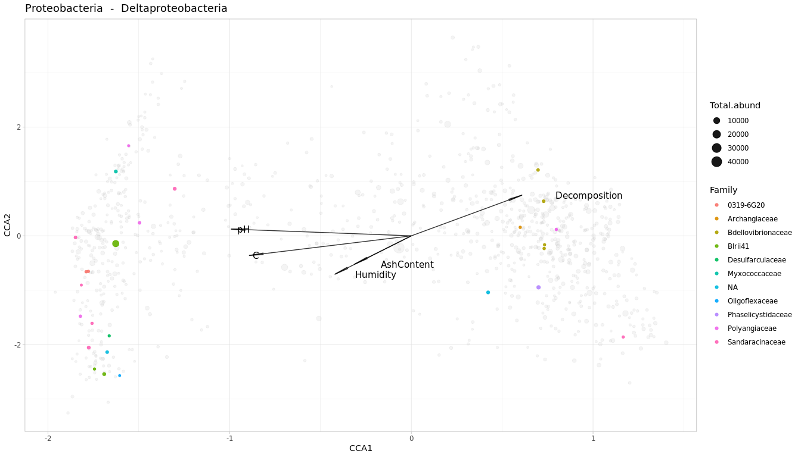<!-- -->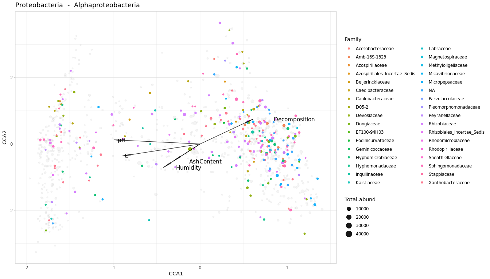<!-- -->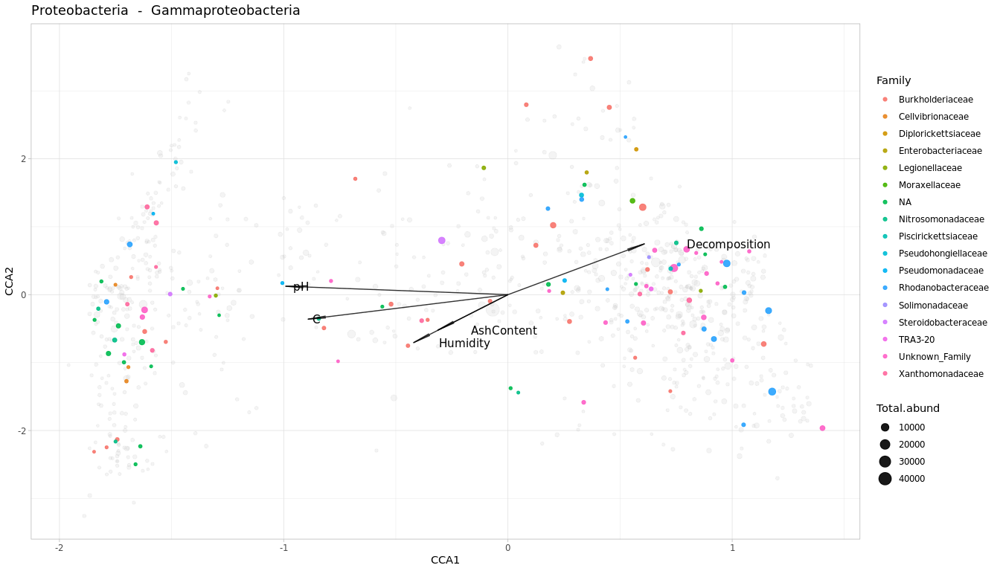<!-- -->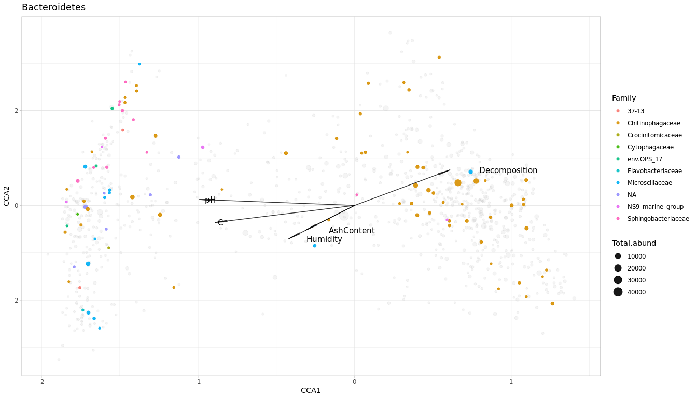<!-- -->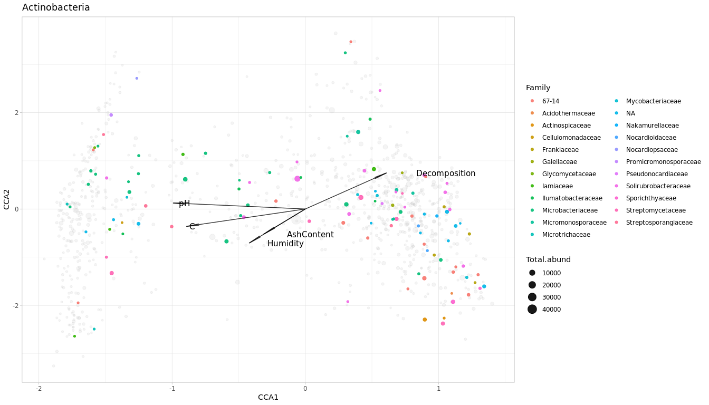<!-- -->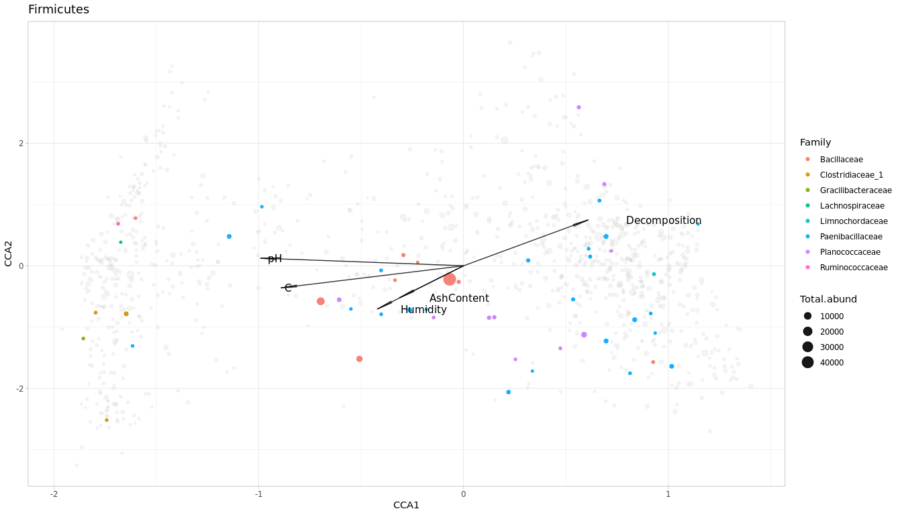<!-- -->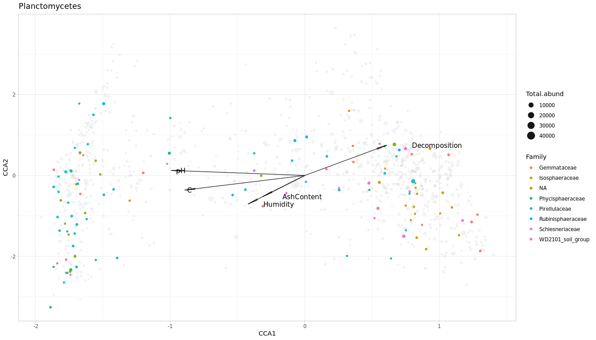<!-- -->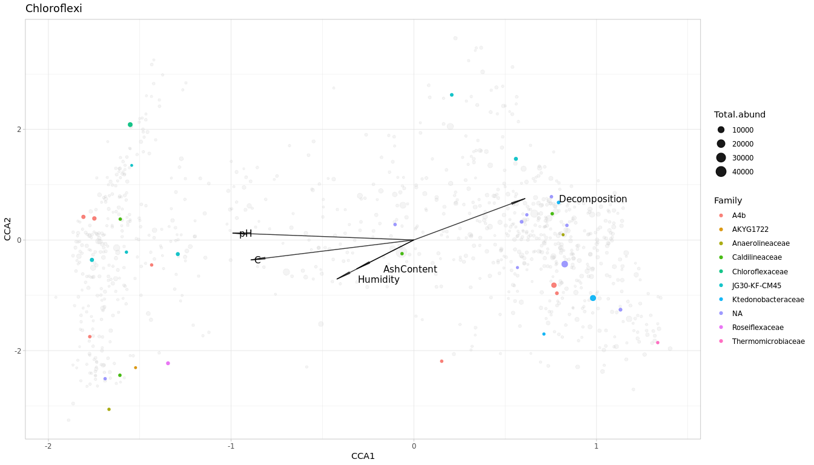<!-- -->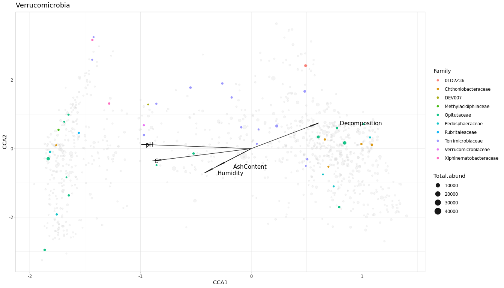<!-- -->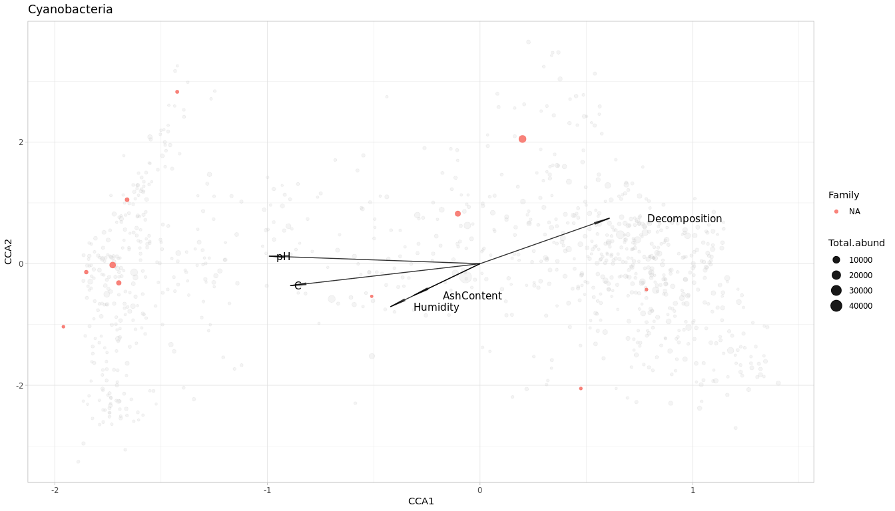<!-- -->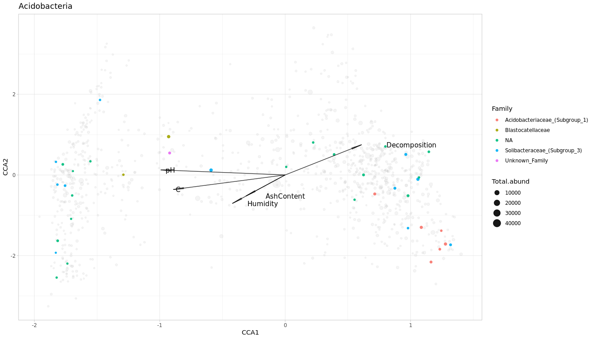<!-- -->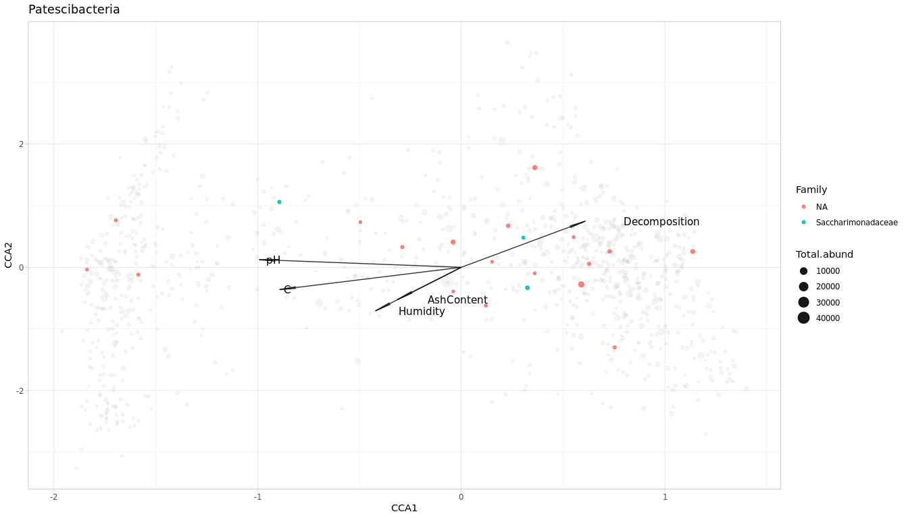<!-- -->

