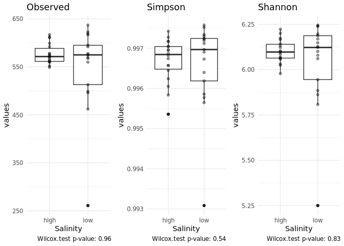
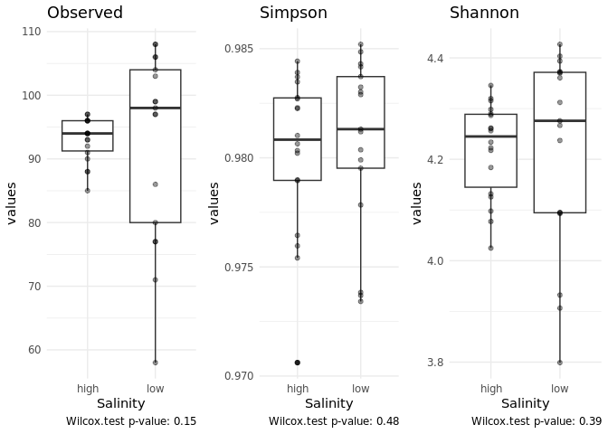

```r
ps <- readRDS("/home/arina/data-processing/lab/andronov-pulkovsk-visoti/r_objects/physeq.RDS")
ps <- subset_samples(ps, salinity %in% c("low", "high"))
ps <- subset_samples(ps, sample_names(ps) != " Andronov-SEQ130-5")

ps %>% sample_sums() %>% sort()
```

```
##  Andronov-SEQ130-5  Andronov-SEQ130-9 Andronov-SEQ130-27 Andronov-SEQ130-26 
##               1010              14852              15143              15623 
## Andronov-SEQ130-53 Andronov-SEQ130-31 Andronov-SEQ130-20 Andronov-SEQ130-52 
##              18646              18667              19003              19638 
## Andronov-SEQ130-50 Andronov-SEQ130-21 Andronov-SEQ130-47 Andronov-SEQ130-30 
##              20087              21041              21812              21970 
## Andronov-SEQ130-25  Andronov-SEQ130-4 Andronov-SEQ130-24 Andronov-SEQ130-35 
##              22041              22075              22113              22400 
## Andronov-SEQ130-28 Andronov-SEQ130-33 Andronov-SEQ130-51 Andronov-SEQ130-54 
##              23234              23332              23492              23661 
##  Andronov-SEQ130-3 Andronov-SEQ130-48 Andronov-SEQ130-32 Andronov-SEQ130-29 
##              23975              24031              24151              24788 
## Andronov-SEQ130-36 Andronov-SEQ130-49  Andronov-SEQ130-6 Andronov-SEQ130-46 
##              25266              26064              26496              26632 
##  Andronov-SEQ130-1  Andronov-SEQ130-7 Andronov-SEQ130-19 Andronov-SEQ130-23 
##              26732              26874              30760              31648 
## Andronov-SEQ130-22  Andronov-SEQ130-8  Andronov-SEQ130-2 
##              33961              36701              45958
```

```r
high.asvs <- ps %>% subset_samples(salinity == 'high') %>% prune_taxa(taxa_sums(.) > 0, .) %>% taxa_names()
low.asvs <- ps %>% subset_samples(salinity == 'low') %>% prune_taxa(taxa_sums(.) > 0, .) %>% taxa_names()
filtered.asvs <- intersect(high.asvs, low.asvs)


ps.all <- prune_taxa(taxa_sums(ps) > 0, ps)
ps.no.zeros <- prune_taxa(filtered.asvs, ps)
ps.majors <- prune_taxa(taxa_sums(ps) > taxa_sums(ps) %>% sum()/1000, ps)
```

# Beta-Diversity

## All taxa

```r
beta_plot <- function(ps, method, distance){
  ps.prop <- transform_sample_counts(ps, function(x) x/sum(x))
  ord.nmds.bray <- ordinate(ps.prop, method=method, distance=distance)
  plot_ordination(ps.prop, ord.nmds.bray, shape='salinity', color='pH.water', title=distance) +
    geom_point(size=3, alpha=0.7) + 
    theme_light()
}

ggarrange(beta_plot(ps.all, "PCoA", "wunifrac"), beta_plot(ps.all, "PCoA", "unifrac"),
          beta_plot(ps.all, "PCoA", "bray"), beta_plot(ps.all, "PCoA", "jaccard"),
          common.legend = T, legend = 'right')
```

<!-- -->

## No zeros 

sum abundance for "high" and "low" salinity, keep only non-zeros for both groups taxa


```r
ggarrange(beta_plot(ps.no.zeros, "PCoA", "wunifrac"), beta_plot(ps.no.zeros, "PCoA", "unifrac"),
          beta_plot(ps.no.zeros, "PCoA", "bray"), beta_plot(ps.no.zeros, "PCoA", "jaccard"),
          common.legend = T, legend = 'right')
```

<!-- -->

## Majors

More than 0.1% (824 reads/taxa)


```r
ggarrange(beta_plot(ps.majors, "PCoA", "wunifrac"), beta_plot(ps.majors, "PCoA", "unifrac"),
          beta_plot(ps.majors, "PCoA", "bray"), beta_plot(ps.majors, "PCoA", "jaccard"),
          common.legend = T, legend = 'right')
```

<!-- -->

# Alpha-diversity

## All taxa


```r
plot_alpha <- function(ps) {
  ps.n <- rarefy_even_depth(ps)
  
  alpha_div <- function(ps){
    ps <- prune_taxa(taxa_sums(ps) > 0, ps)
    obs_sim <- estimate_richness(ps, measures = c("Observed", "Simpson", "Shannon"))
    Salinity <- ps@sam_data$salinity
    alpha <- cbind(obs_sim, Salinity)
    return(alpha)
  }
  
  alpha <- alpha_div(ps.n) %>% 
    tibble() %>% 
    tidyr::pivot_longer(!Salinity, names_to = 'index', values_to = 'values')
  
  obs <- wilcox.test(values ~ Salinity, data = alpha %>% filter(index == 'Observed'))
  simps <- wilcox.test(values ~ Salinity, data = alpha %>% filter(index == 'Simpson'))
  shann <- wilcox.test(values ~ Salinity, data = alpha %>% filter(index == 'Shannon'))
  
  p1 <- ggplot(alpha %>% filter(index == 'Observed'), aes(x=Salinity, y=values)) + 
    geom_boxplot() +
    geom_point(alpha=0.4) +
    theme_minimal() +
    labs(title = "Observed", caption = paste("Wilcox.test p-value:", round(obs$p.value, 2)))
  
  p2 <- ggplot(alpha %>% filter(index == 'Simpson'), aes(x=Salinity, y=values)) + 
    geom_boxplot() +
    geom_point(alpha=0.4) +
    theme_minimal() +
    labs(title = "Simpson", caption = paste("Wilcox.test p-value:", round(simps$p.value, 2)))
  
  p3 <- ggplot(alpha %>% filter(index == 'Shannon'), aes(x=Salinity, y=values)) + 
    geom_boxplot() +
    geom_point(alpha=0.4) +
    theme_minimal() +
    labs(title = "Shannon", caption = paste("Wilcox.test p-value:", round(shann$p.value, 2)))
  
  ggarrange(p1, p2, p3, ncol=3)
}

plot_alpha(ps.all)
```

```
## You set `rngseed` to FALSE. Make sure you've set & recorded
##  the random seed of your session for reproducibility.
## See `?set.seed`
```

```
## ...
```

```
## 3678OTUs were removed because they are no longer 
## present in any sample after random subsampling
```

```
## ...
```

```
## Warning in wilcox.test.default(x = DATA[[1L]], y = DATA[[2L]], ...): cannot
## compute exact p-value with ties

## Warning in wilcox.test.default(x = DATA[[1L]], y = DATA[[2L]], ...): cannot
## compute exact p-value with ties
```

<!-- -->

## No zeros


```r
plot_alpha(ps.no.zeros)
```

```
## You set `rngseed` to FALSE. Make sure you've set & recorded
##  the random seed of your session for reproducibility.
## See `?set.seed`
```

```
## ...
```

```
## 219OTUs were removed because they are no longer 
## present in any sample after random subsampling
```

```
## ...
```

```
## Warning in wilcox.test.default(x = DATA[[1L]], y = DATA[[2L]], ...): cannot
## compute exact p-value with ties

## Warning in wilcox.test.default(x = DATA[[1L]], y = DATA[[2L]], ...): cannot
## compute exact p-value with ties
```

<!-- -->


## Majors


```r
plot_alpha(ps.majors)
```

```
## You set `rngseed` to FALSE. Make sure you've set & recorded
##  the random seed of your session for reproducibility.
## See `?set.seed`
```

```
## ...
```

```
## Warning in wilcox.test.default(x = DATA[[1L]], y = DATA[[2L]], ...): cannot
## compute exact p-value with ties
```

<!-- -->
