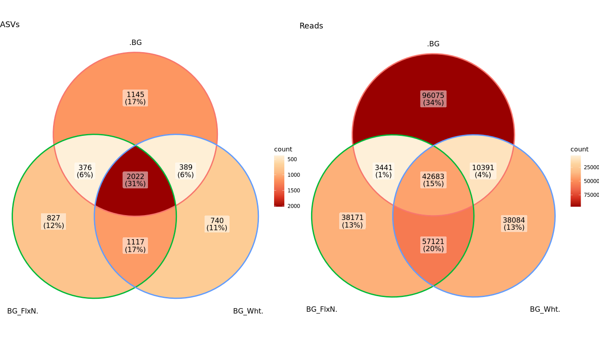

---


```r
knitr::opts_chunk$set(warning = FALSE, message = FALSE)
knitr::opts_chunk$set(fig.width=14, fig.height=8) 

library(phyloseq)
library(ggplot2)
library(ggpubr)
library(dplyr)
library(ggVennDiagram)

set.seed(5678)
setwd('/home/alexey/Analysis/2022_StrawPrimers/2023')

ps <- readRDS("ps.RData")
# ps@sam_data %>% View()
ps@sam_data$Compare <- paste(ps@sam_data$Primer, ps@sam_data$Substrate, sep=".")

ps.sub <- subset_samples(ps, Type == "substrate")
```

# Intersections between soils and substrates


```r
plot_vienn <- function(ps, group){
  physeq <- prune_taxa(taxa_sums(ps) > 0, ps)
  groups <- levels(sample_data(physeq)[[group]] %>% as.factor())
  data <- merge_samples(physeq, group) %>% 
    psmelt() %>% 
    group_by(Sample, OTU) %>% 
    summarise(ASVs_abund = list(paste(OTU, 1:sum(Abundance))), Abund = sum(Abundance), .groups='keep') %>% 
    filter(Abund > 0)
  
  asvs <- data %>% select(Sample, OTU) %>% group_by(Sample) %>% summarise(ASVs = list(OTU)) %>% as.list()
  d1 <- asvs[[2]]
  names(d1) <- asvs[[1]]
  d1
  
  weighted.asvs <- data %>% select(Sample, ASVs_abund) %>% group_by(Sample) %>% summarise(ASVs = list(unlist(ASVs_abund)))
  d2 <- weighted.asvs[[2]]
  names(d2) <- weighted.asvs[[1]]
  d2
  
  
  list(ggVennDiagram(d1) + ggtitle("ASVs") + scale_fill_distiller(palette = "OrRd", trans = "reverse"),
       ggVennDiagram(d2) + ggtitle("Reads") + scale_fill_distiller(palette = "OrRd", trans = "reverse"))
}
```

## Soils


```r
p <- plot_vienn(ps.sub %>% subset_samples(Substrate %in% c("BS", "DP", "BG")), "Substrate")

ggarrange(p[[1]], p[[2]])
```

<!-- -->

## Substrates


```r
p <- plot_vienn(ps.sub %>% subset_samples(Substrate %in% c("Oat", "Flx", "Wht")), "Substrate")

ggarrange(p[[1]], p[[2]])
```

<!-- -->


# Breeds

## Soils, Substrates and primers

What share breeds takes from substrate and from soil?

### DP vs Wheat vs DP_Wht primer


```r
p <- plot_vienn(ps %>% subset_samples((Substrate %in% c("DP", "Wht", "")) & (Primer %in% c("DP_Wht", ""))), "Compare")

ggarrange(p[[1]], p[[2]])
```

<!-- -->

### DP vs Flax vs DP_FlxN primer


```r
p <- plot_vienn(ps %>% subset_samples((Substrate %in% c("DP", "Flx", "")) & (Primer %in% c("DP_FlxN", ""))), "Compare")

ggarrange(p[[1]], p[[2]])
```

<!-- -->

### BS vs Wheat vs BS_Wht primer


```r
p <- plot_vienn(ps %>% subset_samples((Substrate %in% c("BS", "Wht", "")) & (Primer %in% c("BS_Wht", ""))), "Compare")

ggarrange(p[[1]], p[[2]])
```

<!-- -->

### BS vs Flax vs BS_FlxN primer


```r
p <- plot_vienn(ps %>% subset_samples((Substrate %in% c("BS", "Flx", "")) & (Primer %in% c("BS_FlxN", ""))), "Compare")

ggarrange(p[[1]], p[[2]])
```

<!-- -->

### BG vs Wheat vs BG_Wht primer


```r
p <- plot_vienn(ps %>% subset_samples((Substrate %in% c("BG", "Wht", "")) & (Primer %in% c("BG_Wht", ""))), "Compare")

ggarrange(p[[1]], p[[2]])
```

<!-- -->

### BG vs Flax vs BG_FlxN primer


```r
p <- plot_vienn(ps %>% subset_samples((Substrate %in% c("DP", "Wht", "")) & (Primer %in% c("DP_Wht", ""))), "Compare")

ggarrange(p[[1]], p[[2]])
```

<!-- -->

## Soils and their primers

### DP soil (Dern-Podzol soil)


```r
p <- plot_vienn(ps %>% subset_samples((Substrate %in% c("DP", "")) & (Primer %in% c("DP_Wht", "DP_FlxN", ""))), "Compare")

ggarrange(p[[1]], p[[2]])
```

<!-- -->

### BS soil (Black Soil)


```r
p <- plot_vienn(ps %>% subset_samples((Substrate %in% c("BS", "")) & (Primer %in% c("BS_Wht", "BS_FlxN", ""))), "Compare")

ggarrange(p[[1]], p[[2]])
```

<!-- -->

### BG soil (BAGS)


```r
p <- plot_vienn(ps %>% subset_samples((Substrate %in% c("BG", "")) & (Primer %in% c("BG_Wht", "BG_FlxN", ""))), "Compare")

ggarrange(p[[1]], p[[2]])
```

<!-- -->

# Usage


```r
ps.use <- subset_samples(ps, Type == "use")
```

## Effect of different primers on same substrate

### Different primers on Oat Straw


```r
p <- plot_vienn(ps.use %>% subset_samples((Substrate == "Oat_Straw") & (Primer %in% c("no", "DP_Wht", "BS_Wht", "BG_Wht"))), "Primer")

ggarrange(p[[1]], p[[2]])
```

<!-- -->

```r
p <- plot_vienn(ps.use %>% subset_samples((Substrate == "Oat_Straw") & (Primer %in% c("no", "DP_FlxN", "BS_FlxN", "BG_FlxN"))), "Primer")

ggarrange(p[[1]], p[[2]])
```

<!-- -->

### Different primers on Wheat Straw


```r
p <- plot_vienn(ps.use %>% subset_samples((Substrate == "Wheat_Straw_N") & (Primer %in% c("no", "DP_Wht", "BS_Wht", "BG_Wht"))), "Primer")

ggarrange(p[[1]], p[[2]])
```

<!-- -->

```r
p <- plot_vienn(ps.use %>% subset_samples((Substrate == "Wheat_Straw_N") & (Primer %in% c("no", "DP_FlxN", "BS_FlxN", "BG_FlxN"))), "Primer")

ggarrange(p[[1]], p[[2]])
```

<!-- -->

### Different primers on Flax Shover


```r
p <- plot_vienn(ps.use %>% subset_samples((Substrate == "Flax_Shover_N") & (Primer %in% c("no", "DP_Wht", "BS_Wht", "BG_Wht"))), "Primer")

ggarrange(p[[1]], p[[2]])
```

<!-- -->

```r
p <- plot_vienn(ps.use %>% subset_samples((Substrate == "Flax_Shover_N") & (Primer %in% c("no", "DP_FlxN", "BS_FlxN", "BG_FlxN"))), "Primer")

ggarrange(p[[1]], p[[2]])
```

<!-- -->


## Effect of same primers on different substrates

### DP_Wht primer on different substrates


```r
p <- plot_vienn(ps %>% subset_samples((Primer == "DP_Wht") & (Substrate %in% c("Oat_Straw", "Wheat_Straw_N", "Flax_Shover_N", ""))), "Compare")

ggarrange(p[[1]], p[[2]])
```

<!-- -->

### DP_FlxN primer on different substrates


```r
p <- plot_vienn(ps %>% subset_samples((Primer == "DP_FlxN") & (Substrate %in% c("Oat_Straw", "Wheat_Straw_N", "Flax_Shover_N", ""))), "Compare")

ggarrange(p[[1]], p[[2]])
```

<!-- -->


### BS_Wht primer on different substrates


```r
p <- plot_vienn(ps %>% subset_samples((Primer == "BS_Wht") & (Substrate %in% c("Oat_Straw", "Wheat_Straw_N", "Flax_Shover_N", ""))), "Compare")

ggarrange(p[[1]], p[[2]])
```

<!-- -->

### BS_FlxN primer on different substrates


```r
p <- plot_vienn(ps %>% subset_samples((Primer == "BS_FlxN") & (Substrate %in% c("Oat_Straw", "Wheat_Straw_N", "Flax_Shover_N", ""))), "Compare")

ggarrange(p[[1]], p[[2]])
```

<!-- -->


### BG_Wht primer on different substrates


```r
p <- plot_vienn(ps %>% subset_samples((Primer == "BG_Wht") & (Substrate %in% c("Oat_Straw", "Wheat_Straw_N", "Flax_Shover_N", ""))), "Compare")

ggarrange(p[[1]], p[[2]])
```

<!-- -->


### BG_FlxN primer on different substrates


```r
p <- plot_vienn(ps %>% subset_samples((Primer == "BG_FlxN") & (Substrate %in% c("Oat_Straw", "Wheat_Straw_N", "Flax_Shover_N", ""))), "Compare")

ggarrange(p[[1]], p[[2]])
```

<!-- -->

### DP_FlxN primer on different substrates


```r
p <- plot_vienn(ps %>% subset_samples((Primer == "DP_FlxN") & (Substrate %in% c("Oat_Straw", "Wheat_Straw_N", "Flax_Shover_N", ""))), "Compare")

ggarrange(p[[1]], p[[2]])
```

<!-- -->
